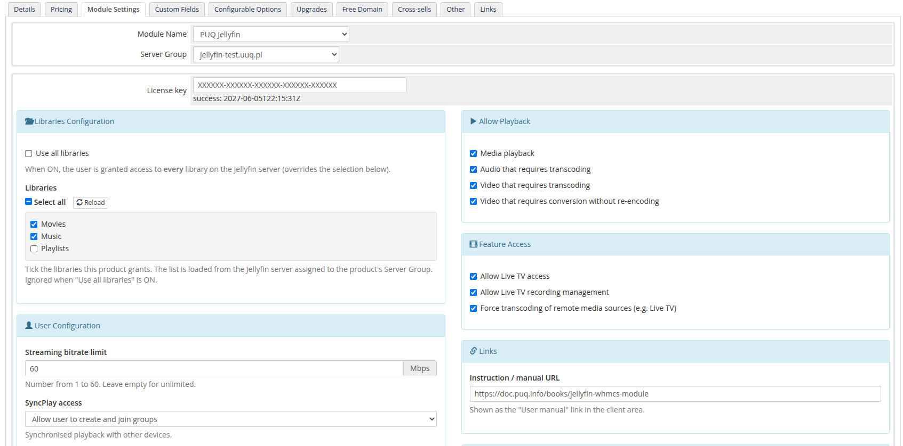

# WHMCS Module Installation and Update

### Jellyfin module **[WHMCS](https://puqcloud.com/link.php?id=77)**
#####  [Order now](https://puqcloud.com/whmcs-module-jellyfin.php) | [Download](https://download.puqcloud.com/WHMCS/servers/PUQ_WHMCS-Jellyfin/) | [Community](https://community.puqcloud.com/)

## Supported PHP & WHMCS versions

The module supports **PHP 7.4, 8.1 and 8.2+** and **WHMCS 8.x / 9.x**, and is shipped as a **separate ionCube build per PHP version**. Download the build that matches the PHP version your WHMCS runs on.

| WHMCS version | PHP version | Module build |
|---------------|-------------|--------------|
| WHMCS 8.x | 7.4 | `php74` |
| WHMCS 8.x | 8.1 | `php81` |
| WHMCS 8.x | 8.2 | `php82` |
| WHMCS 9.x | 8.2 | `php82` |

> Match the build to your **server's PHP version**, not to the WHMCS version. PHP 8.2 and any newer PHP → always use `php82`. Requires **ionCube Loader v13+** (v14/v15 supported).

## Download

The module is distributed as a single ZIP archive. A separate build is published for each supported PHP major version — pick the one that matches the PHP runtime used by your WHMCS installation.

All versions and historical builds are available in the index:

- [https://download.puqcloud.com/WHMCS/servers/PUQ_WHMCS-Jellyfin/](https://download.puqcloud.com/WHMCS/servers/PUQ_WHMCS-Jellyfin/)

### Direct "latest" downloads

#### PHP 8.2

```bash
wget https://download.puqcloud.com/WHMCS/servers/PUQ_WHMCS-Jellyfin/php82/PUQ_WHMCS-Jellyfin-latest.zip
```

#### PHP 8.1

```bash
wget https://download.puqcloud.com/WHMCS/servers/PUQ_WHMCS-Jellyfin/php81/PUQ_WHMCS-Jellyfin-latest.zip
```

#### PHP 7.4

```bash
wget https://download.puqcloud.com/WHMCS/servers/PUQ_WHMCS-Jellyfin/php74/PUQ_WHMCS-Jellyfin-latest.zip
```

> Not sure which PHP version your WHMCS runs on? Check **Utilities > System > PHP Info** in the WHMCS admin area.

## Installation

### Step 1: Unzip the Archive

On your WHMCS server (or locally, before uploading):

```bash
unzip PUQ_WHMCS-Jellyfin-latest.zip
```

The archive extracts into a `PUQ_WHMCS-Jellyfin/` directory containing the server module folder `puqJellyfin`.

### Step 2: Copy the Server Module

Copy and replace `puqJellyfin` from the extracted `PUQ_WHMCS-Jellyfin/` directory to your WHMCS installation:

```
PUQ_WHMCS-Jellyfin/puqJellyfin  →  WHMCS_WEB_DIR/modules/servers/puqJellyfin/
```

Example:

```bash
cp -r PUQ_WHMCS-Jellyfin/puqJellyfin /var/www/html/whmcs/modules/servers/
```

### Step 3: ionCube Loader

Ensure **ionCube Loader v13+** is installed and enabled for the PHP version your WHMCS runs on. The module source is encoded with ionCube.

### Step 4: License key

Each product that uses this module requires a valid license key in the **License key** field of the product's **Module Settings** tab. Invalid or missing licenses are listed on the WHMCS admin homepage.



> The module self-creates its database tables (`puq_license`, `puq_module_versions`) on first load — there is no SQL to run manually.

## File Structure

After installation, the module files should be located at:

```
whmcs/
├── modules/
│   └── servers/
│       └── puqJellyfin/            # Server module
│           ├── puqJellyfin.php
│           ├── hooks.php
│           ├── whmcs.json
│           ├── lib/
│           ├── lang/
│           └── templates/
```

## Update Procedure

To update the module to a newer version:

1. Back up your WHMCS installation (and the existing `modules/servers/puqJellyfin/` directory).
2. Download the latest build that matches your server's PHP version (see **Download** above).
3. Upload and overwrite the files in `modules/servers/puqJellyfin/`.
4. Open any WHMCS admin page once — the migration runner brings the schema up to date automatically.

> **Upgrading from v2.x:** no reconfiguration is required. The module reads existing product settings from the legacy `configoption3`–`configoption8` slots until you save the product once through the new form, at which point they are consolidated into `configoption24`.

> **Tip:** always back up your WHMCS installation before performing an update.
