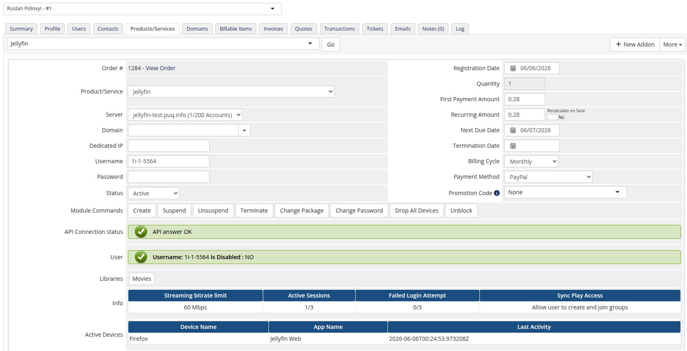

# Service page

### Jellyfin module **[WHMCS](https://puqcloud.com/link.php?id=77)**
#####  [Order now](https://puqcloud.com/whmcs-module-jellyfin.php) | [Download](https://download.puqcloud.com/WHMCS/servers/PUQ_WHMCS-Jellyfin/) | [Community](https://community.puqcloud.com/)

On the WHMCS admin service page (**Clients → (client) → Products/Services**) the module adds an information tab and the standard module command buttons.

## Module commands
- **Create** — generates credentials, creates the Jellyfin user and applies the policy.
- **Suspend / Unsuspend** — toggles the user's *IsDisabled* flag.
- **Change Package** — re-applies the product policy to the existing user.
- **Change Password** — resets and sets a new password.
- **Terminate** — deletes the Jellyfin user.

## Custom buttons
- **Drop All Devices** — removes all of the user's registered devices.
- **Unblock** — re-enables a disabled account (requires the service to be *Active*).

## Information tab
- **API Connection status** — confirms the module can reach Jellyfin.
- **User** — username and disabled state (with a too-many-failed-logins warning).
- **Libraries** — the libraries the user can access.
- **Info** — streaming bitrate limit, active sessions, failed-login counter and SyncPlay access.
- **Active Devices** — device name, app and last activity.

> All lifecycle actions are license-gated: if the license cache is stale and the license server is unreachable, the action is refused with the license error.
