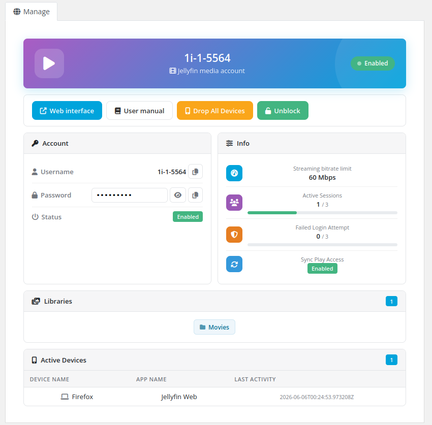

# Description

### Jellyfin module **[WHMCS](https://puqcloud.com/link.php?id=77)**
#####  [Order now](https://puqcloud.com/whmcs-module-jellyfin.php) | [Download](https://download.puqcloud.com/WHMCS/servers/PUQ_WHMCS-Jellyfin/) | [Community](https://community.puqcloud.com/)

## Jellyfin WHMCS module

The **Jellyfin WHMCS module** turns your WHMCS into an automated platform for selling **Jellyfin media-server accounts**. Each WHMCS service is mapped to a Jellyfin user whose access is fully driven by the product configuration: which libraries the user can see, what playback and transcoding is allowed, Live TV access, SyncPlay, streaming bitrate limit, maximum active sessions and failed-login lockout.

Account provisioning is automatic — on **Create** the module generates the username and password, creates the Jellyfin user and applies the configured policy. **Suspend / Unsuspend / Change package / Terminate** keep the Jellyfin user in sync with the WHMCS service lifecycle. Clients manage everything from the WHMCS client area.

---

## What's new in v3.0

Version 3.0 is a **complete rewrite** that brings the module up to the modern PUQ standard:

- 🎨 **Redesigned client area** — a beautiful, fully **AJAX** card-based interface: a gradient status hero, account credentials with copy/show, live usage bars (sessions, failed logins), library chips and an active-devices table. No page reloads — every action reports back with a toast.
- 🗂️ **Dynamic library picker** — libraries are now loaded **live from your Jellyfin server** as checkboxes with *Select all* and *Reload*, instead of typing names by hand.
- 🔌 **Jellyfin 10.11.10+ ready** — switched to the modern `Authorization: MediaBrowser` scheme and the current API routes, so the module keeps working on Jellyfin **10.12 / 10.13** where the legacy authorization is removed.
- 🧰 **One-click self-service** — clients can **drop all devices** and **unblock** their account straight from the client area.
- ⚙️ **Streamlined configuration** — all product settings live in a single, injected settings panel; upgrading from v2.x needs **no reconfiguration**.
- 🛡️ **Hardened & diagnosable** — PHP 7.4 / 8.1 / 8.2+ clean, null-safe, with full error logging to the WHMCS Module Log for easy troubleshooting.
- 🌍 **25 languages** — the full interface is translated.

---

## Main features

- **Automatic provisioning** — Jellyfin user created on service activation with generated credentials
- **Full lifecycle sync** — suspend, unsuspend, change package, terminate and change password
- **Library access control** — grant all libraries or a selected set per product
- **Playback & transcoding policy** — media playback, audio/video transcoding, remux without re-encoding, force remote-source transcoding
- **Feature access** — Live TV access and recording management
- **Session & security limits** — streaming bitrate limit, maximum active sessions, failed-login lockout
- **SyncPlay & downloads** — SyncPlay access level and media-download control
- **Flexible credentials** — configurable password generation and standard or macro-based custom username templates
- **AJAX client area** — modern card-based UI showing status, credentials, allowed libraries, active devices and sessions
- **Self-service actions** — clients can drop all devices and unblock their account
- **Admin service tab** — user status, libraries, package info and active devices on the WHMCS service page
- **Multi-language** — 25 languages
- **License verification** — built-in online/offline license system with admin homepage alerts

---

## System requirements & compatibility

The module supports **PHP 7.4, 8.1 and 8.2+**, shipped as a separate ionCube build per PHP version. Download the build that matches the PHP version your WHMCS runs on.

| WHMCS version | PHP version | Module build |
|---------------|-------------|--------------|
| WHMCS 8.x | 7.4 | `php74` |
| WHMCS 8.x | 8.1 | `php81` |
| WHMCS 8.x | 8.2 | `php82` |
| WHMCS 9.x | 8.2 | `php82` |

> Match the build to the **server's PHP version**, not to the WHMCS version. PHP 8.2 and any newer PHP → always use `php82`. Requires ionCube Loader v13+.

A reachable **Jellyfin server, version 10.11.10 or newer**, with an administrator account and API key is required. The module uses the modern `Authorization: MediaBrowser` scheme and the current user/password API routes, so it stays compatible with Jellyfin 10.12/10.13 where the legacy authorization headers are removed.
